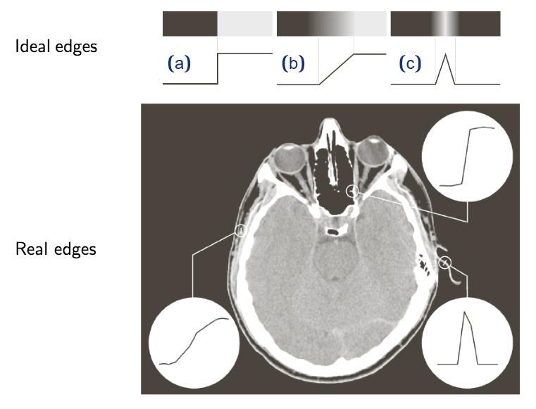
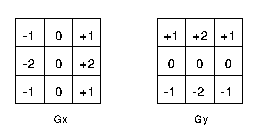
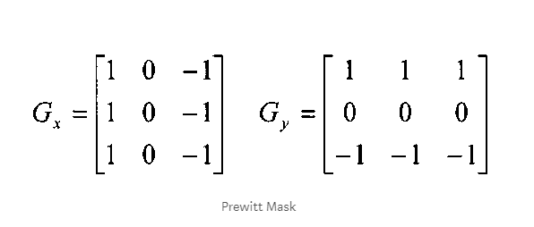
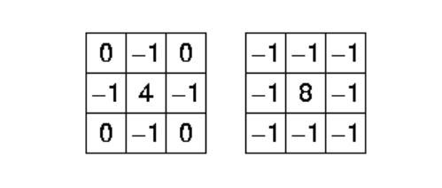
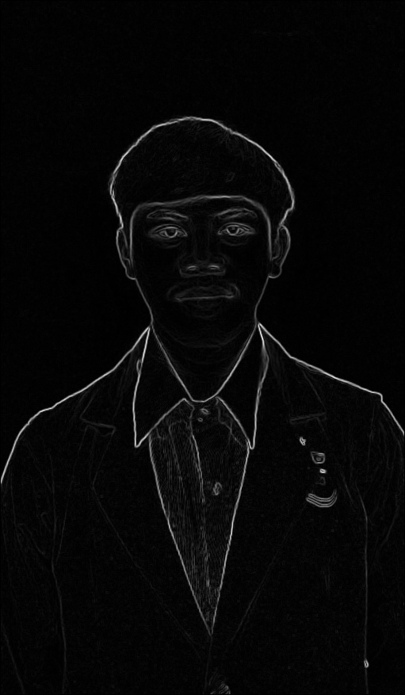
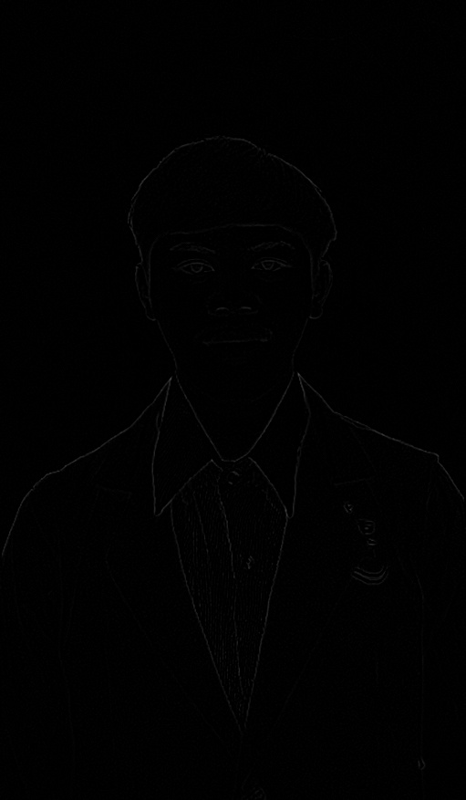

## By MARIO
## Deteksi Tepi Menggunakan Operator Sobel, Prewitt dan Laplacian

### Apa itu Edge?
Area di mana terdapat perbedaan ekstrim dalam intensitas piksel biasanya menunjukkan tepi suatu objek.

### Jenis tepi edges
Ini adalah jenis utama tepi ideal yang ada dalam gambar. Cara perubahan intensitas gambar dalam suatu gambar menentukan jenis tepi yang ada pada posisi itu. Gambar 1 membantu mengilustrasikan perbedaan ini dengan menggunakan garis untuk merepresentasikan intensitas gambar piksel terhadap jarak dalam arah x atau y dari sebuah gambar.

**a.** Step Edge - Where image intensity immediately increases over a distance.  
**b.** Ramp Edge - Where image intensity gradually increases over a distance.  
**c.** Roof Edge - Where image intensity spikes up temporarily over a distance.
[Article and Edge Type Image Reference](http://www.doc.ic.ac.uk/~ts2615/contribution.html#1)

### Menggunakan Sobel operator
Sobel adalah operator yang sangat umum untuk mendeteksi tepi gambar, yang merupakan pendekatan turunan gambar, yang terpisah dalam arah y dan x. Di sini Kami menggunakan matriks kernel 3 * 3, satu untuk setiap arah x dan y. Gradien untuk arah-x memiliki angka minus di kiri dan angka positif di kanan dan kami mempertahankan piksel tengah. Demikian pula, gradien untuk arah-y memiliki angka minus di bagian bawah dan angka positif di atas dan di sini kita tengah piksel baris.

### Prewitt operator
Operator prewitt mirip dengan operator Sobel dan digunakan untuk mendeteksi tepi vertikal dan horizontal pada gambar. Operator ini memberi kita dua masker, satu untuk mendeteksi tepi dalam arah horizontal dan satu lagi untuk mendeteksi tepi dalam arah vertikal.

### Menggunakan Operator Laplacian 
Tidak seperti detektor tepi Sobel dan prewitt, detektor tepi Laplacian hanya menggunakan satu kernel. Ini menghitung turunan urutan kedua dalam satu lintasan. Inilah kernel yang digunakan untuk itu:

### Outputs

 

